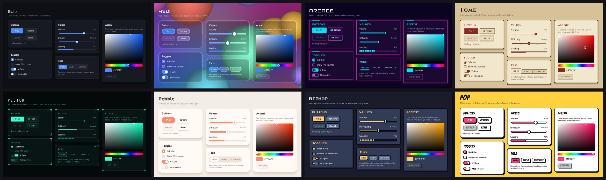
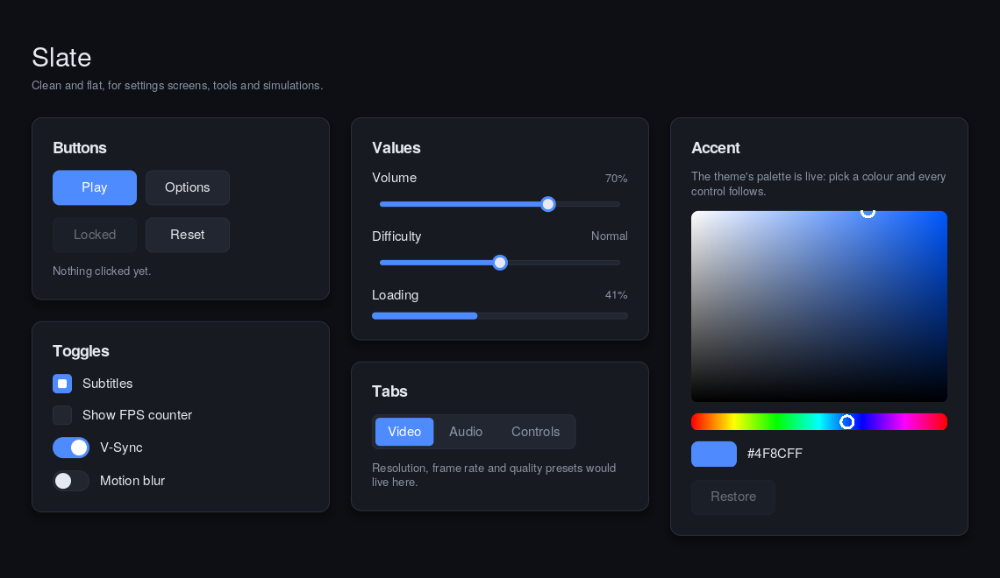
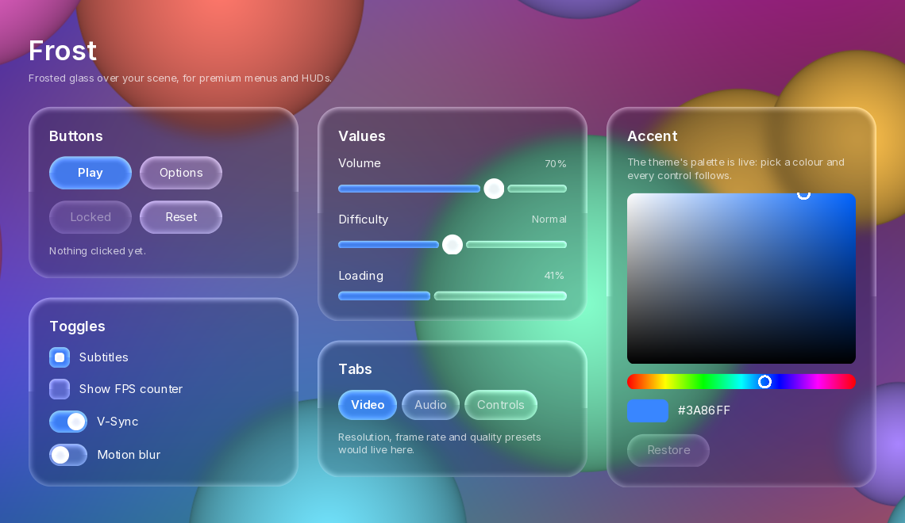
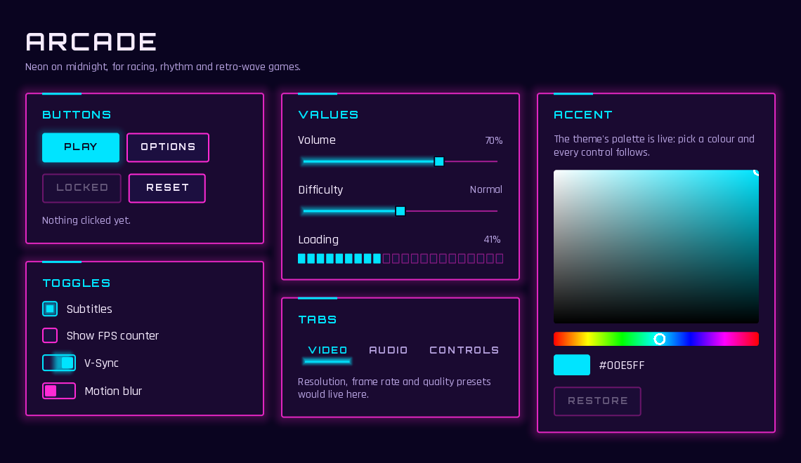
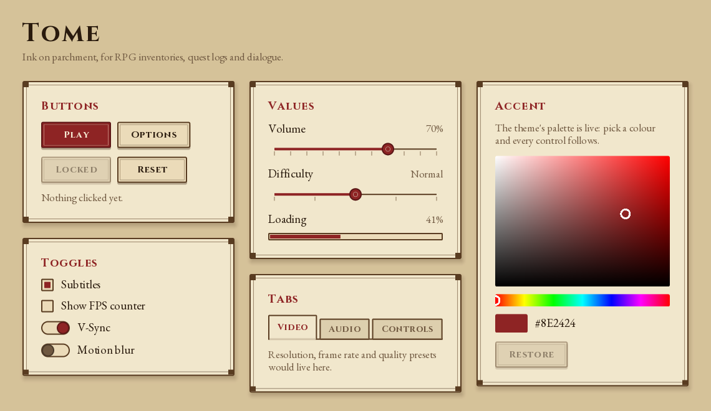
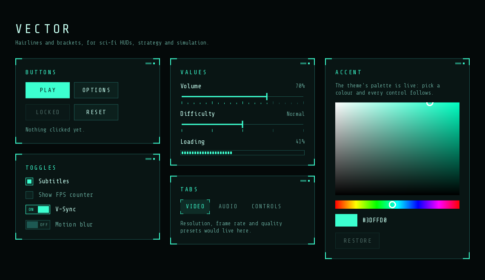
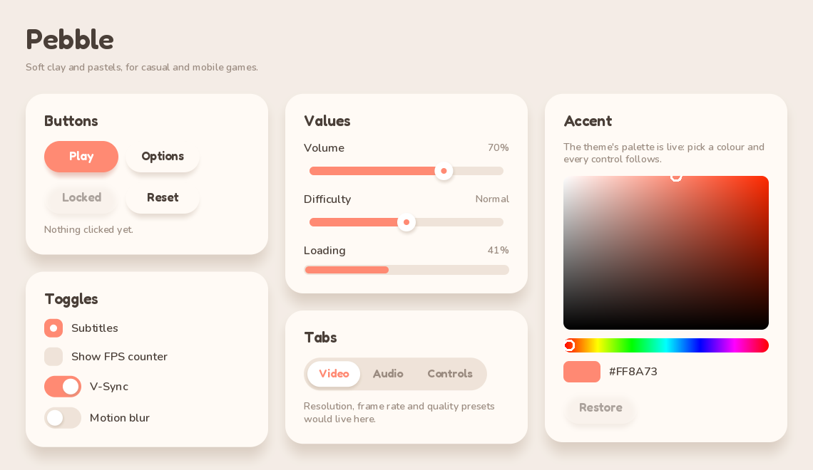
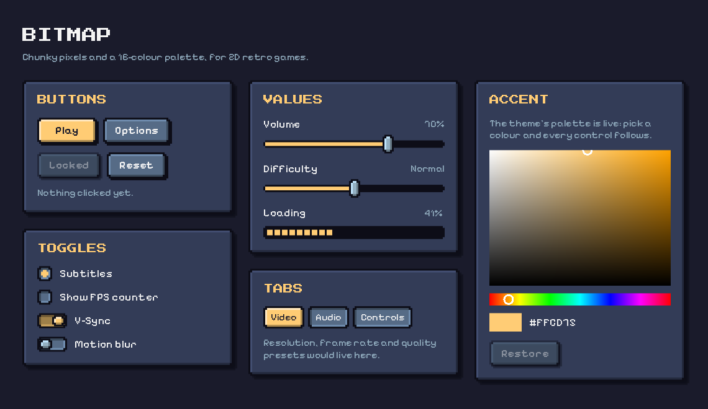
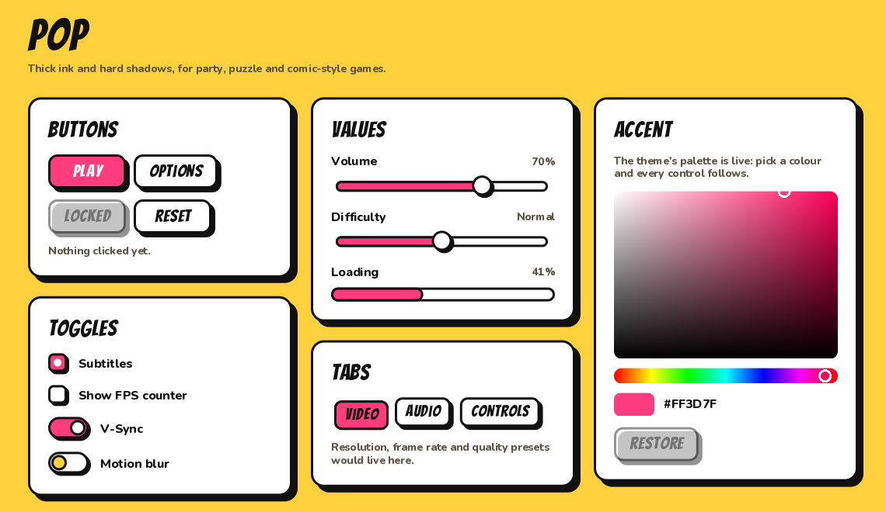

# Quill — a declarative, reactive UI framework for Unity (URP)

*Free and open source under the [MIT License](LICENSE.md). Scope and roadmap: [`SCOPE.md`](SCOPE.md).*

Quill brings a clean declarative authoring model to Unity: real `.quill` text documents, a **reactive
property + binding** engine, **anchors-based layout**, reusable **components**, and a low-level
renderer (no uGUI/Canvas) built around a single full-screen SDF pass plus lightweight textured layers.



*One document, eight themes — the gallery that ships with Quill. See [Themes](#themes).*

## Quick start

1. Add Quill to your project (it runs on URP or the Built-in pipeline).
2. In a scene with a camera, use **GameObject ▸ Quill ▸ Quill Document** and press **Play**. With no
   document assigned it shows the **theme gallery** — every control of the chosen theme.
3. Assign your own `.quill` document to **Quill Document ▸ Document**, and pick a **Theme** in the same
   inspector. The document renders and animates itself, driven by bindings; resize the Game view and
   the anchored layout follows.

`.quill` files import as text assets automatically and are syntax-checked on import.

**Themes.** Quill ships with **Slate**, a clean flat theme. Seven more come as samples — **Frost**,
**Arcade**, **Tome**, **Vector**, **Pebble**, **Bitmap** and **Pop**: in **Package Manager ▸ Quill ▸
Samples**, import one, open its `<Theme> Gallery.unity` and press **Play**. Every theme implements the
same controls with the same properties, so switching theme never means editing a document — see
[Themes](#themes).

## Editor support

`.quill` files are meant to be written by hand, so Quill ships a **language server** with clients
for **VS Code**, **Rider** and **Visual Studio**: highlighting, diagnostics as you type (with "did you
mean" suggestions), completion (elements, your components, properties, handlers, ids, the `Theme`
palette, enums), hover docs, go to definition, outline and folding. In Unity, double-clicking a
`.quill` file opens it in your external code editor, and `.quill` files are included in the
generated solution. Setup per editor: [`Tooling~/README.md`](Tooling~/README.md).

## Elements

| Element           | Properties (beyond x/y/width/height/visible/opacity/state)                        |
|-------------------|------------------------------------------------------------------------------------|
| `Item`            | — (invisible base; container/anchor target)                                        |
| `Rectangle`       | `color`, `radius`, `border.width`, `border.color`, `softness` (edge feather, px: soft shadows and glows) |
| `Text`            | `text`, `color`, `fontSize` / `font.pixelSize`, `font.bold`, `font.italic`, `font.family`, `font.letterSpacing`, `font.capitalization`, `wrapMode`, `horizontalAlignment`, `verticalAlignment`, `elide`, `lineHeight`; read-only `contentWidth`, `contentHeight`, `lineCount` |
| `Image`           | `source` (a `Resources` path), `color` (tint)                                      |
| `Row` `Column` `Grid` `Flow` | `spacing`, `padding` (+ per side); Grid also `columns`, `rowSpacing`, `columnSpacing` |
| `Repeater`        | `model` (a count or a list, live); delegate gets `index` / `modelData`; `count`, `itemAt(i)` |
| `MouseArea`       | `enabled`, `hoverEnabled`, reactive `pressed` / `containsMouse` / `mouseX` / `mouseY`, `drag.*`; `on*` signals |
| `ShaderEffect`    | `shader` + any custom property, forwarded as a uniform                             |
| `QtObject`        | — (a plain object for grouping properties, e.g. a theme palette)                   |
| `Timer`           | `interval`, `running`, `repeat`, `triggeredOnStart`; `onTriggered`; `start/stop/restart()` |
| Animations        | `NumberAnimation`, `PropertyAnimation`, `ColorAnimation`, `SpringAnimation`, `SmoothedAnimation`, `PauseAnimation`, `SequentialAnimation`, `ParallelAnimation`, `ScriptAction`, `PropertyAction` |
| `Behavior`        | `Behavior on prop { Animation }`, `enabled`                                        |
| `State` `PropertyChanges` `Transition` | see [States & transitions](#states--transitions)                |

`Rectangle` is drawn in the full-screen SDF pass (rounded corners + anti-aliased border).
`Text` uses Unity's dynamic-font atlas; `Image` is a textured quad. Add new element types via
`QuillTypeRegistry.Register(...)`.

## Anchors

Every item exposes six anchor lines in absolute coordinates — `left, right, top, bottom,
horizontalCenter, verticalCenter` — so anchoring is just a binding onto another item's line:

```quill
Rectangle {
    anchors.left: bar.right          // pin to a sibling's edge
    anchors.leftMargin: 20
    anchors.verticalCenter: parent.verticalCenter
}
```

Supported: `anchors.fill`, `anchors.centerIn`, the four edges (`left/right/top/bottom`), the two
centers, `anchors.margins` plus per-side margins, and `horizontalCenterOffset` /
`verticalCenterOffset`. Because lines are absolute, anchoring to a sibling and to `parent` use the
same math. Anchors override explicit `x/y/width/height` on the axes they control, exactly as you would expect.
Layout is fully reactive: change a window size, a sibling's geometry, or a model value, and only the
affected items recompute.

## Positioners

`Row`, `Column`, `Grid` and `Flow` lay out their children automatically and size themselves to their
content — all through bindings, so layout reacts live to child sizes, visibility and spacing:

```quill
Row {
    spacing: 8
    padding: 12                      // or leftPadding / rightPadding / topPadding / bottomPadding
    Rectangle { width: 40; height: 40 }
    Rectangle { width: 40; height: 40; visible: false }   // hidden children take no space
    Rectangle { width: 40; height: 40 }
}
Grid { columns: 3; spacing: 6; /* children flow row-major */ }
Flow { width: 360; spacing: 8; /* wraps onto new lines within its width */ }
```

Grid sizes each column to its widest child and each row to its tallest. A `Flow` with a set `width`
wraps its children; without one it behaves like a `Row`. Each positioner solves its whole layout in
one binding (children just pick their slot), so a size change costs O(children), and children added
or removed at runtime by a `Repeater` join the layout on their own. Positioners manage the main axis
(Row → x, Column → y, Grid/Flow → both); don't also anchor a positioned child on the same axis.

## Text

`Text` is content-sized by default: it measures itself and takes `contentWidth` / `contentHeight` as
its size, so anchors see the real extent. Give it a `width` (or anchor it) and it wraps, aligns and
elides inside that box:

```quill
Text {
    anchors.fill: parent; anchors.margins: 14
    text: "A paragraph that wraps.\nLine breaks work too."
    wrapMode: Text.WordWrap              // NoWrap, WordWrap, WrapAnywhere, Wrap
    horizontalAlignment: Text.AlignHCenter
    verticalAlignment: Text.AlignVCenter
    lineHeight: 1.25
    font.bold: true                      // font.italic, font.pixelSize too
}
Text { width: 200; elide: Text.ElideRight; text: "Too long to fit, so it ends with…" }
```

**Fonts.** `font.family` picks the font: empty is Unity's built-in font; a path names a font asset
under any `Resources` folder (`"Fonts/MyFont"`); otherwise it is a comma-separated list of installed
font names, the first one found wins (`"Georgia, Times New Roman"`). Installed fonts vary by platform,
so for a shipped game put the font in `Resources` — the theme samples bundle theirs that way.
`font.letterSpacing` adds pixels between characters and `font.capitalization: Font.AllUppercase` (or
`AllLowercase`, `Capitalize`) changes case at display time, so `text` keeps the original.

## Animation

Quill's animation model follows QML. An animation runs on its own as a **value source**
(`NumberAnimation on x`, running by default), as a **standalone** element (`running: true` or
`start()`), inside a `Behavior`, or as part of a `Transition`.

```quill
NumberAnimation on phase {
    from: 0; to: 1
    duration: 1500
    loops: Animation.Infinite        // or a finite count
    easing.type: Easing.InOutQuad
}
```

**Types.** `NumberAnimation` and `ColorAnimation` (and `PropertyAnimation` for either) tween from
`from` (default: the current value) to `to`; `SpringAnimation` (`spring`, `damping`, `mass`,
`epsilon`, `velocity`) is damped-spring physics, stepped at a fixed 16 ms like QML so it feels the
same at any frame rate; `SmoothedAnimation` (`velocity`, `duration`) eases toward a moving target;
`PauseAnimation` waits; `ScriptAction { script: ... }` runs statements; `PropertyAction` sets a value
instantly. `SequentialAnimation` and `ParallelAnimation` group any of them, nested freely:

```quill
SequentialAnimation {
    id: intro
    loops: Animation.Infinite
    NumberAnimation { target: card; property: "x"; to: 300; duration: 800; easing.type: Easing.OutBounce }
    PauseAnimation { duration: 300 }
    ParallelAnimation {
        NumberAnimation { target: card; properties: "x,y"; to: 0; duration: 600 }
        ColorAnimation { target: card; property: "color"; to: "#ff4f8b"; duration: 600 }
    }
    ScriptAction { script: laps++ }
}
```

Control from handlers or C#: `start()`, `stop()`, `restart()`, `pause()`, `resume()`, `complete()`;
bind `running` / `paused`; handle `onStarted`, `onStopped`, `onFinished`. Standalone animations wait
for `running: true` or `start()`, as in QML.

**Easing** — `Linear` plus `In`, `Out`, `InOut` and `OutIn` forms of `Quad`, `Cubic`, `Quart`, `Quint`,
`Sine`, `Expo`, `Circ`, `Back`, `Elastic` and `Bounce` (e.g. `Easing.OutElastic`), shaped by
`easing.amplitude`, `easing.period` and `easing.overshoot`. `easing.type` is a live binding.

**Behavior** animates every change of a property — from a binding, an assignment, a state change or
C# `SetValue`:

```quill
Rectangle {
    x: area.containsMouse ? 200 : 0
    color: active ? "#3a86ff" : "#243044"
    Behavior on x { SpringAnimation { spring: 3; damping: 0.2 } }
    Behavior on color { ColorAnimation { duration: 200 } }
}
```

A new value mid-flight retargets smoothly (springs and smoothed animations keep their momentum).
Behaviors don't animate a document's initial values. `enabled: false` turns one off.

## States & transitions

Any item can declare named `states`, each a set of `PropertyChanges`, and `transitions` that animate
between them. Set `state` to switch, or give a State a `when` condition:

```quill
Rectangle {
    id: panel
    x: 0; width: 120; color: "#3a86ff"

    states: [
        State { name: "open"; PropertyChanges { target: panel; x: 200; width: 300; color: "#ff4f8b" } },
        State { name: "alert"; when: errors > 0; extend: "open"; PropertyChanges { panel.color: "red" } }
    ]
    transitions: [
        Transition {
            from: ""; to: "open"; reversible: true
            NumberAnimation { properties: "x,width"; duration: 400; easing.type: Easing.OutBack }
            ColorAnimation { duration: 300 }
        }
    ]
}
```

`PropertyChanges` values are live bindings (`target: panel; x: parent.width - 40` keeps tracking);
leaving a state restores the original values **and bindings** (unless `restoreEntryValues: false`).
`id.property: value` is shorthand for a separate target; `extend` builds on another state; `explicit:
true` applies values once instead of binding them. A transition picks the first `from`/`to` match
(exact names before `*`, comma lists allowed, `reversible` for the way back); its animations run in
parallel, animate only the properties that changed — filtered by `properties`/`targets` and by type
(`NumberAnimation` numbers, `ColorAnimation` colours) — and the rest jump. A transition's `running`
tells you when it's in flight.

## Timer

```quill
Timer { interval: 1000; running: true; repeat: true; onTriggered: seconds++ }
```

`triggeredOnStart` fires once as it starts; `start()`, `stop()`, `restart()` from handlers or C#.

## Repeater

`Repeater` instantiates its delegate (its single child) once per model entry, generating real scene
items **into the Repeater's parent**, right after the Repeater — so they flow through anchors,
positioners, and rendering like any other element. `model` is a count or a list, and it is **live**:
when it changes, instances are added or removed (list entries that remain just get their new data).
Each instance gets `index`, plus `modelData` for list models, and has its **own id scope**, so an
`id` inside the delegate names that instance's item:

```quill
Flow {
    width: 360; spacing: 8
    Repeater {
        model: tags                          // e.g. property var tags: ["a", "b", "c"]
        Rectangle {
            width: 80; height: 30; radius: 15
            color: chip.containsMouse ? "#3a86ff" : "#243044"
            Text { anchors.centerIn: parent; text: modelData }
            MouseArea { id: chip; anchors.fill: parent; hoverEnabled: true
                        onClicked: tags = tags.slice(0, index).concat(tags.slice(index + 1)) }
        }
    }
}
```

`count` is the number of instances; `itemAt(i)` returns one. Lists are values: build a new list
(`concat`, `slice`) rather than mutating one in place. The rectangle layer uploads all rects into a
single `StructuredBuffer` and composites them in **one draw call**, so thousands of `Repeater` cells
stay a single pass.

> Requires shader model 4.5 (StructuredBuffer in the fragment stage) — fine on desktop D3D11/Vulkan/Metal.

## Talking to C# — values & events

Keep a reference to the `QuillEngine` (a Quill Document's is `GetComponent<QuillDocument>().Engine`,
ready after `Awake`), then reach **document-level ids** (use-site `id`s, including children written
inside a component at the use-site; component internals stay private). Three patterns, pick per need:

**1. Pull a value when you need it** — simplest, ideal for "apply settings on close":

```csharp
float master = (float)engine.GetNumber("masterVol", "value");
bool  fs     = engine.GetBool("fullscreen", "checked");
```

**2. Push: react to a value changing** — for live updates, no per-frame polling:

```csharp
engine.OnChanged("masterVol", "value", v => audio.volume = (float)(double)v);
```

**3. Subscribe to signals** — for actions/events:

```csharp
engine.Connect("playBtn", "clicked", () => StartGame());   // any signal, by bare name
// or, for a MouseArea directly:
((QuillMouseArea)engine.FindId("hitArea")).Clicked += OnHit;
```

Going the other way (C# → Quill) is just `engine.SetValue("hpBar", "value", hp / maxHp)`, or call a
document function / built-in method with `engine.Invoke("menu", "open", "settings")` (e.g.
`engine.Invoke("intro", "restart")` on an animation). Signals with parameters reach C# through
`engine.Connect("slider", "moved", (object[] args) => ...)`. So the clean
split is: **C# owns the model**, drives Quill with `SetValue`, and listens via `OnChanged`/`Connect`;
Quill owns presentation and notifies C# through signals. Re-subscribe after a reload (`LoadFromSource`
rebuilds the tree). Avoid reading values every frame in `Update` when a `Connect`/`OnChanged` hook
will do — but a one-shot pull on a button press is perfectly fine and the easiest place to start.

**No-code option — the `Quill Bindings` component.** Drop it on the Quill Document GameObject and wire hooks
in the inspector: a **Signals** list maps `id` + `signal` → a `UnityEvent` (e.g. `playBtn`/`clicked` →
your scene loader), and a **Values** list maps `id` + `property` → `UnityEvent<float/bool/string>`
(e.g. `masterVol`/`value` → an AudioMixer). It finds the engine automatically and re-wires on reload,
so designers can connect game logic without touching C#.

## Showing & hiding a surface (menus)

Treat each `QuillSurface` as one screen/menu. Toggle it with `Visible` (or `Show()`/`Hide()`/`Toggle()`):

```csharp
surface.Visible = false;   // closed menu: nothing drawn, animations + input paused
surface.Toggle();          // e.g. on the Escape key-down edge
```

Don't use the component's `enabled` flag for this — disabling the MonoBehaviour stops its update
loop but leaves the layer renderers active, so the last frame stays frozen on screen. `Visible`
deactivates the whole layer subtree (nothing draws) and pauses ticking, then resumes on show.

For multiple menus, give each its own `QuillSurface` + document and toggle them independently. If two
visible surfaces must stack in a defined order, offset their layer render-queues (they currently
use 4000–4100).

## Custom shaders — ShaderEffect

`ShaderEffect` draws a quad with a custom Unity shader.
Because Unity can't compile shader *source strings* at runtime, you reference a `.shader` **by name**;
every custom Quill property on the effect is forwarded as a **uniform of the same name**:

```quill
ShaderEffect {
    anchors.fill: parent
    shader: "Quill/Effect/Blur"
    tint: "#4fc3f780"                    // -> color uniform `tint` (#RRGGBBAA)
    radius: 4.0 + 24.0 * slider.value    // -> float uniform `radius`, fully reactive
}
```

The engine always supplies `_Rect` (x,y,w,h px), `_ScreenSize` and `_Opacity`. For animation, use
Unity's built-in `_Time` (`_Time.y` is seconds since the level loaded).
Forwarding rules: `real`→`float`, `bool`→`float`, `color`→`color`. Write your shader against the
Quill convention (clip-space vertex with the `_ProjectionParams.x` Y-flip, `uv` 0..1 top-left) — see
`Shaders/QuillEffectBlur.shader` as a copy-paste template. Effects render on the overlay layer (above
rectangles, below text), so a `Rectangle` placed behind an effect is covered by it regardless of tree
order — tint inside the shader instead. Overlapping effects draw in tree order.

> **Declare your uniforms.** List every forwarded uniform (plus `_Rect` and `_Opacity`) in the
> shader's `Properties` block, and on URP put them in `CBUFFER_START(UnityPerMaterial)`. With bare
> global uniforms the SRP Batcher ignores per-material values, so when several effects are on screen
> they all draw with one effect's rect and properties (wrong shapes, missing tints).

### The bundled effect — `Quill/Effect/Blur`

A frosted backdrop blur, and the base layer to build glass-style panels on:

| Property       | Type    | Meaning                                              | Unset (`0`) |
|----------------|---------|------------------------------------------------------|-------------|
| `radius`       | `real`  | blur radius in screen pixels                          | no blur     |
| `cornerRadius` | `real`  | rounded-corner radius in pixels                       | square      |
| `tint`         | `color` | colour laid over the blur, by its alpha               | untinted    |

Every default is the "off" state, because unset Quill properties arrive at the shader as `0`.

**What it blurs differs by pipeline**, and it is worth knowing which you are on:

- **URP** samples `_CameraOpaqueTexture` — a copy of the opaque scene taken *before* transparents. It
  holds the game world but no Quill UI, so the blur picks up the scene behind the surface and ignores
  Quill rectangles under it. **Enable "Opaque Texture" on your URP asset**; with it off the texture is
  black and the panel renders flat dark.
- **Built-in** uses a `GrabPass`, which copies the live framebuffer at this queue. Quill rectangles
  draw at queue 4000, before effects, so here the blur *does* pick up Quill panels behind it.

Blurring an arbitrary Quill sub-tree identically on both pipelines needs `ShaderEffectSource`, which
isn't implemented yet — see `SCOPE.md`.

### `Quill/Effect/Glass`

The whole effect rect becomes a rounded pane of glass: the backdrop is refracted toward the centre
near the edges (a convex lens look), blurred, and lit with a thin rim highlight and a soft top-down
sheen. It reads its backdrop exactly like `Quill/Effect/Blur`, so the same URP / Built-in notes apply.

```quill
ShaderEffect {
    width: 420; height: 260
    shader: "Quill/Effect/Glass"
    cornerRadius: 32
    refraction: 40
    radius: 6
}
```

| Property       | Type    | Meaning                                                   | Unset (`0`)          |
|----------------|---------|-----------------------------------------------------------|----------------------|
| `cornerRadius` | `real`  | rounded-corner radius in pixels                           | square               |
| `refraction`   | `real`  | width in pixels of the lens band along the edge           | no refraction        |
| `softness`     | `real`  | width in pixels of the rounded (bevelled) glass edge      | sharp, flat edge     |
| `radius`       | `real`  | blur radius in screen pixels                              | no blur              |
| `tint`         | `color` | colour laid over the backdrop, by its alpha               | untinted             |

The silhouette is always crisp; `softness` shapes the edge instead of fading it. It is the width of a
quarter-round bevel that curves from vertical at the silhouette to flat `softness` pixels in: its
normals refract the backdrop and catch a top-left highlight, a fainter bottom-right bounce and a
grazing reflection. A few pixels read as a polished edge, tens of pixels as a thick rounded slab; the
bevel is capped at half the pane's smaller side, so thin panes become glass tubes. At `0` the edge is
flat, with a thin rim line. The sheen is always on — it is part of what makes it read as glass.

The **Frost** theme is built on it. Two rules to follow in glass UIs: **anything drawn on glass is
`Text` or another effect** (rectangles render below effects), and glass shows the *scene*, not other
Quill elements — so give it something behind (the Frost sample's `FrostBackdrop` is an animated 3D
backdrop, and on URP turns on the camera's Opaque Texture for you).

> In a build, add custom effect shaders to **Project Settings ▸ Graphics ▸ Always Included Shaders**
> (or keep them under `Resources`) so `Shader.Find` can locate them; in the editor it just works.
> `ShaderEffectSource` (rendering a sub-tree to a texture) isn't implemented yet.


## Themes

A theme is a folder of `.quill` files under `Resources/QuillThemes/<Name>`: one file per control, plus
`Theme.quill`, the **palette**. Pick one on the **Quill Document** (the inspector lists the themes in the
project), or from C#:

```csharp
var engine = new QuillEngine();
QuillThemes.Apply(engine, "Arcade");      // the controls + the palette (Slate underneath)
engine.LoadFromSource(uiText);
```

**Every theme implements the same controls** with the same properties and signals, so a document
written against one works with all of them:

| Control       | API                                                                                     |
|---------------|-----------------------------------------------------------------------------------------|
| `Panel`       | a card: size it and put children in it (keep them `Theme.padding` in from the edges)     |
| `Label`       | `text`, `kind`: `"title"`, `"heading"`, `"body"` (default), `"caption"`                  |
| `Button`      | `text`, `highlighted`, `enabled`; read-only `down`, `hovered`; `signal clicked`          |
| `CheckBox`    | `text`, `checked`, `enabled`; `signal toggled`                                           |
| `Switch`      | `text`, `checked`, `enabled`; `signal toggled`                                           |
| `Slider`      | `value`, `from`, `to`, `step`, `enabled`; read-only `position`, `pressed`; `signal moved` |
| `ProgressBar` | `value`, `from`, `to`; read-only `position`                                              |
| `TabBar`      | `model` (list of strings), `currentIndex`, `enabled`; `signal activated(int index)`      |
| `ColorPicker` | `color`, `showAlpha`; `signal moved(color color)` — shared, drawn with the theme's palette |

```quill
Panel {
    width: 340; height: content.height + 2 * Theme.padding
    Column {
        id: content
        x: Theme.padding; y: Theme.padding
        spacing: Theme.spacing
        Label  { kind: "heading"; text: "Audio" }
        Slider { id: volume; width: 292; from: 0; to: 100; value: 70 }
        Switch { text: "Subtitles"; checked: true }
        Button { text: "Apply"; highlighted: true; onClicked: apply() }
    }
}
```

**The palette** is a global object, `Theme`, that every document and component can read:
`name`, `tagline`, `background`, `surface`, `border`, `control`, `controlHover`, `accent`,
`accentText`, `text`, `textMuted`, `radius`, `borderWidth`, `padding`, `spacing`, `font`,
`titleFont`, `fontSize`, `titleSize`, `duration` (themes may add their own, e.g. Frost's glass
settings). Use it to make your own elements fit the theme — `color: Theme.surface`,
`font.family: Theme.font` — and write to it to restyle live: `Theme.accent = "#ff5a5f"` recolours
every control at once (the gallery's Accent panel does exactly that).

| Theme      | Look                                                          | Made for                               |
|------------|---------------------------------------------------------------|----------------------------------------|
| **Slate**  | clean, flat, quiet (built-in)                                 | settings screens, tools, simulations   |
| **Frost**  | frosted glass that blurs and refracts the 3D scene            | premium menus, pause screens, HUDs     |
| **Arcade** | neon outlines and glows on midnight purple                    | racing, rhythm, retro-wave             |
| **Tome**   | ink on parchment, Cinzel capitals, a wax-red accent           | RPG inventories, quest logs, dialogue  |
| **Vector** | hairlines, corner brackets, monospace capitals                | sci-fi HUDs, strategy, simulation      |
| **Pebble** | soft clay, pastels, deep soft shadows, springy motion         | casual and mobile games                |
| **Bitmap** | bevelled pixel blocks, a 16-colour palette, pixel fonts       | 2D retro games                         |
| **Pop**    | thick ink, hard offset shadows, Bangers headlines             | party, puzzle, comic-style games       |

<table>
<tr>
<td><br><b>Slate</b></td>
<td><br><b>Frost</b></td>
</tr>
<tr>
<td><br><b>Arcade</b></td>
<td><br><b>Tome</b></td>
</tr>
<tr>
<td><br><b>Vector</b></td>
<td><br><b>Pebble</b></td>
</tr>
<tr>
<td><br><b>Bitmap</b></td>
<td><br><b>Pop</b></td>
</tr>
</table>

Each sample has one scene, `<Theme> Gallery.unity`: a Quill Document showing the gallery
(`Resources/QuillThemes/Gallery.quill` in the package) with that theme. The themes' fonts are free (SIL
Open Font License; the licences are in each sample's `Licenses` folder, outside `Resources`).

**Making your own theme:** copy a theme folder to `Resources/QuillThemes/MyTheme` in your project,
rename it, edit `Theme.quill` for the palette and restyle the controls you want. Anything you leave out
falls back to Slate's version, drawn with your palette — a theme can be just a `Theme.quill`. Keep each
control's properties and signals as listed above, and documents stay interchangeable.

## Reusable components

Any `.quill` file can become a **reusable type**, instantiated by name like a built-in element. The
theme's controls are components too — a Quill Document registers them automatically — so a document
can just write:

```quill
Button { width: 200; text: "Run"; onClicked: runs = runs + 1 }
Slider { id: vol; width: 320; value: 0.4 }
Label  { text: "volume " + vol.value.toFixed(2) }    // read a control's state by id
Switch { id: snd; checked: true }
ProgressBar { value: load }
ColorPicker { id: picker; color: "#3a86ff"; onMoved: swatch.color = color }
```

**Authoring a component** (see `Resources/QuillThemes/Slate/Slider.quill`):

- The component's **root-declared properties are its public API** — set them at the use-site, read
  them by id. `property real value: 0.4` on the Slider root *is* its value.
- **`property alias text: label.text`** exposes an inner property directly: reads, writes, bindings
  and use-site overrides all go to `label.text`. `property alias label: label` exposes an inner item.
- Declare **signals** with parameters — `signal moved(real value)` — and emit them with a call:
  `control.moved(0.5)`. The use-site handles them with `onMoved: level = value` (parameters are
  locals of the handler; C# gets them via `Connect(id, signal, (object[] args) => ...)`).
- Declare **functions** — `function reset(to) { value = to }` — callable as `picker.reset(0)`, as
  `reset(0)` anywhere inside the component, from bindings, or from C# with `engine.Invoke(id, name, args)`.
- **`Component.onCompleted`** runs once the item and its children are built (children first);
  **`on<Property>Changed`** handlers (`onValueChanged`, `onStateChanged`) run when a property changes.
- **`id`s are component-local**: two `Slider`s each have their own internal `area`/`track` — no
  collisions. The use-site `id`, and the ids of children written at the use-site, live in the outer
  document scope (so a `Panel`'s content is reachable from the rest of the document).
- Use-site **property overrides win** over the component's defaults (also through aliases), use-site
  **handlers run alongside** the component's own, and use-site **children** are appended to the root.
- A component's root may itself be another component — it extends it.

Register your own from C# (`QuillEngine.RegisterComponent("MyWidget", uiText)`), or list the `.quill`
files in the Quill Document's **Components** (they're registered after the theme's, so a `Button.quill`
there replaces the theme's button).

## Input — MouseArea

`MouseArea` is an invisible input region. It exposes **reactive** `pressed`, `containsMouse`,
`mouseX` / `mouseY` (area-local) state you bind visuals to, and fires signals you handle with
statements:

```quill
Rectangle {
    id: button
    property int count: 0
    color: click.pressed ? "#1565c0" : (click.containsMouse ? "#1e88e5" : "#2b3147")

    Text { text: "Clicked " + button.count + " times"; anchors.centerIn: parent }

    MouseArea {
        id: click
        anchors.fill: parent
        hoverEnabled: true
        onClicked: button.count++
        onDoubleClicked: button.count = 0
        onWheel: button.count += wheel.angleDelta.y > 0 ? 1 : -1
    }
}
```

Signals: `onPressed`, `onReleased`, `onClicked`, `onDoubleClicked`, `onPressAndHold`, `onEntered`,
`onExited`, `onPositionChanged` — each pointer handler gets a `mouse` object (`mouse.x`, `mouse.y`,
`mouse.button`) — and `onWheel` with a `wheel` object (`wheel.angleDelta.y`, 120 per notch). The
second click of a double-click doesn't also emit `clicked`. Hit-testing picks the topmost area (later
in tree order); `enabled: false` opts out; wheel events go to the topmost area that handles them.

**Dragging** is declarative:

```quill
Rectangle {
    id: knob
    width: 38; height: 38; radius: 19
    MouseArea {
        anchors.fill: parent
        drag.target: knob
        drag.axis: Drag.XAxis                // YAxis, XAndYAxis
        drag.minimumX: 0; drag.maximumX: 300 // minimumY / maximumY too
    }
}
```

`drag.active` turns true once the pointer moves past `drag.threshold` (4 px); a drag doesn't emit
`clicked`. For app-side logic, every signal also raises a C# event — grab the area by id and
subscribe:

```csharp
var area = (QuillMouseArea)_engine.FindId("click");
area.Clicked += () => Debug.Log("clicked from C#");
```

Input is read by `QuillSurface` (new Input System if present, else the legacy manager) and fed to
`QuillEngine.Update(dt, x, y, down, wheelX, wheelY)`. To drive it from your own input source, call
that overload yourself.

## Expressions & bindings

`width: parent.width * 0.42`, `x: bar.x + bar.width + 20`, `opacity: 0.55 + 0.45 * phase`.
Dependencies are captured automatically while a binding evaluates; when a source changes, the binding
is invalidated and recomputed on the next frame's flush. Assigning a property in a handler replaces
its binding, as in QML.

Expressions are a JavaScript subset:

- operators `+ - * / %`, comparisons (`==`/`===`, `!=`/`!==`, `< > <= >=`), `&& || !` (returning an
  operand, so `name || "none"` works), bit flags `| &`, the ternary `cond ? a : b`, unary `-`/`+`;
- numbers (`1.5e3`, `0xff`), strings, `true`/`false`, `null`, **lists** `[a, b]` with `list[i]` and
  `list.length`;
- member access, including grouped properties (`rect.border.color`, `drag.active`, `font.bold`);
- `Math.*` (`abs min max floor ceil round trunc sign sqrt pow exp log log2 log10 sin cos tan asin
  acos atan atan2 hypot random clamp`, `Math.PI`, `Math.E`);
- **colours**: `Qt.rgba(r, g, b, a)`, `Qt.hsva(h, s, v, a)`, `Qt.hsla(h, s, l, a)`, `Qt.lighter(c, f)`,
  `Qt.darker(c, f)`, `Qt.tint(base, over)`, `Qt.alpha(c, a)`, `Qt.colorEqual(a, b)`; channels
  `c.r .g .b .a`, `c.hsvHue .hsvSaturation .hsvValue`, `c.hslHue .hslSaturation .hslLightness`
  (all 0..1; hue is -1 for greys). A colour prints as `#rrggbb` (or `#rrggbbaa`);
- **value methods**: numbers `toFixed(n)`, `toPrecision(n)`, `toString(radix)`; strings `length`,
  `toUpperCase`, `toLowerCase`, `trim`, `slice`, `substring`, `indexOf`, `includes`, `startsWith`,
  `endsWith`, `split`, `replace`, `replaceAll`, `padStart`, `padEnd`, `repeat`, `charAt`, Qt's
  `"%1 of %2".arg(a).arg(b)`; lists `indexOf`, `includes`, `join`, `slice`, `concat`;
- globals `parseInt`, `parseFloat`, `Number`, `String`, `Boolean`, `isNaN`, `isFinite`, `qsTr`;
- enums: `Easing.*`, `Animation.Infinite`, `Text.AlignHCenter` / `Text.WordWrap` / `Text.ElideRight`…,
  `Drag.XAxis`…, `Qt.AlignLeft`…, `Qt.LeftButton`…

Custom properties: `property real phase: 0` (also `int`, `bool`, `string`, `color`, `var`, `list<T>`,
`alias`). Colours accept `"red"`, `"#RRGGBB"` and `"#RRGGBBAA"`.

## Handlers & functions

Signal handlers, `function` bodies and `ScriptAction` scripts are statements:

```quill
onClicked: {
    count++                              // also += -= *= /= and --
    var next = (index + 1) % items.length
    if (next == 0) laps += 1
    else if (next > 3) log("late")
    for (var i = 0; i < 3; i++) total += i
    anim.restart()                       // built-in methods: animations, timers, repeaters
    control.moved(next)                  // emit a signal, with arguments
}
function log(msg) { console.log("[menu]", msg) }
```

`if`/`else`, `for`, `while`, `break`, `continue`, `return`, `var`/`let`/`const` locals, and
`console.log/warn/error` are supported. A bare call (`reset()`) finds the nearest function or signal
of that name in scope. Loops are capped at 100 000 iterations and recursion at 64 levels.

## Architecture

```
.quill text
  └─ Parsing/      Lexer → Parser → AST (objects, expressions, statements, functions)
        └─ QuillEngine   instantiate → aliases → anchor lines → bindings → positioners → anchors →
              │           text sizing → handlers → repeaters → behaviors / states / animations →
              │           Component.onCompleted  (the same pipeline builds Repeater delegates later)
              ├─ Core/    QuillProperty (reactive cell) + Binding (auto dependency tracking) + queue,
              │             Builtins (Math/Qt/methods), Interpreter (statements), QuillColor
              ├─ Scene/   QuillObject / QuillItem / elements + Anchors + Positioners + Animations
              │             (jobs, easing, behaviors, states & transitions, timers) + input
              ├─ QuillDocument / QuillThemes   the scene component; themes (Resources/QuillThemes)
              └─ Render/   QuillSurface orchestrates the layers:
                              QuillRectLayer   → full-screen SDF, StructuredBuffer   queue 4000
                              QuillImageLayer  → one textured quad per Image         queue 4001
                              QuillShaderEffectLayer → one quad per ShaderEffect     queue 4002–4097
                              QuillTextLayer   → one glyph mesh per font (TextLayout) queue 4100
```

## Known limitations (prototype)

- **Layer ordering** is fixed: text over effects/images over rectangles, not strictly interleaved by
  tree order. Fine for the common case (labels/icons on top of panels); a future unified per-quad path
  would remove it.
- **No clipping yet** (`clip: true`), so no scroll views; no keyboard focus or text input.
- **Text** uses Unity dynamic fonts (`font.family`); no rich text or kerning yet.
- **Images** load from `Resources` by path string (`source: "icons/logo"` → `Resources/icons/logo`).
- The SDF pass uploads rects via a `StructuredBuffer` (safety ceiling 131072), one draw call.

## Extending it

- **New element**: subclass `QuillItem`, seed defaults, `QuillTypeRegistry.Register(...)`; add a draw path
  if it isn't a rectangle.
- **More built-ins**: value methods and `Qt.*` functions live in `Core/Builtins.cs`; statements in
  `Core/Interpreter.cs`; new syntax goes through `Parser` + the AST.
- **Custom methods on an element**: override `QuillObject.TryInvokeMethod` (see `QuillTimer`).

## Suggested next layers

Keyboard focus, `Keys` handlers and a `TextInput`; clipping and a `Flickable`/scroll view;
`ShaderEffectSource`; `ListModel`; rich text; `Loader`; more theme controls (`TextField`, `Dropdown`,
`Dialog`, `Tooltip`).

## Prior art

Quill's authoring model — declarative object trees, reactive property bindings, anchor-based layout,
components and signals — follows a design lineage that will be familiar to anyone who has written
QML. Quill is an independent implementation written for Unity: it is not affiliated with or endorsed
by any third-party UI toolkit, and no code is derived from one. It is likewise independent of uGUI
and UI Toolkit.

## Contributing

Issues and pull requests are welcome at
[github.com/lchaumartin/Quill](https://github.com/lchaumartin/Quill). Two things to keep in mind when
working in this repo:

- It is a Unity package, so `.meta` files are part of the source — commit them alongside the files
  they describe, and never regenerate them by hand.
- `SCOPE.md` is the reference for the feature surface. If a change moves something between
  *Implemented*, *Not yet*, and *Out of scope*, update that file in the same commit, and add a
  `CHANGELOG.md` entry.

## License

MIT © 2026 Leo CHAUMARTIN. See [`LICENSE.md`](LICENSE.md) for the full text.

You are free to use Quill in commercial and closed-source projects, modify it, and redistribute it;
the only requirement is that the copyright notice and permission notice travel with substantial
portions of the software.
